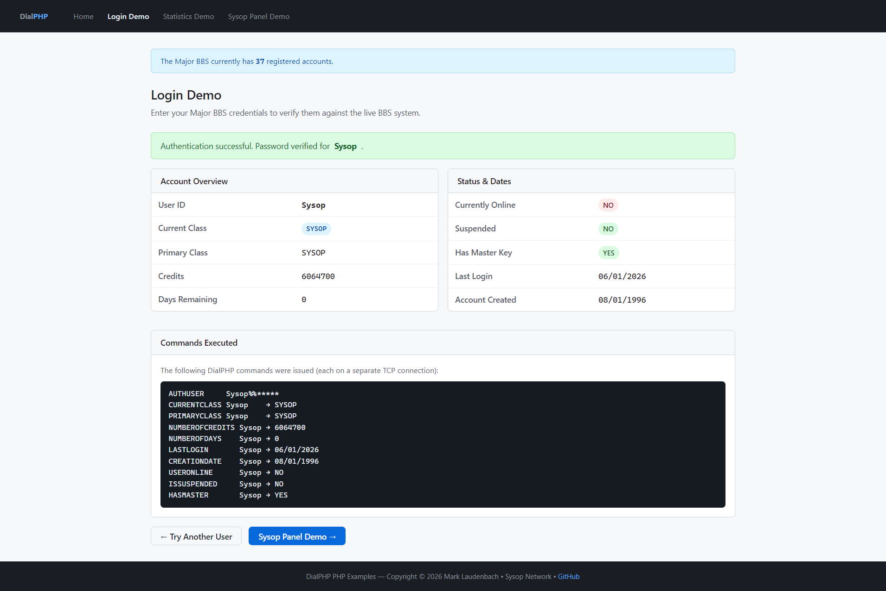

# DialPHP

[](LICENSE)
[]()
[]()
[]()

**TCP/IP authentication and user-management module for The Major BBS v10.** DialPHP loads as a Windows DLL into your BBS server and opens a TCP port that allows external PHP web applications to authenticate users, query account information, and perform administrative operations in real time.

---

## Screenshot



---

## Overview

DialPHP is a modernization of **DialASP**, originally developed by DialSoft for Worldgroup 3.x NT. The module has been re-built for **The Major BBS v10** using Microsoft Visual Studio, with the commercial licensing and registration code removed in favor of an open MIT license.

Once the DLL is loaded by the BBS server, any PHP script on your web host can open a TCP socket, authenticate with a shared secret, issue one command, and receive a response — all within a single connection. This makes it straightforward to build login portals, member dashboards, sysop panels, and automated account management tools without requiring direct database access.

### Key Features

- **24 supported commands** — user verification, authentication, key management, credits, days, class switching, account actions, field updates, audit messages, and system statistics
- **Shared secret authentication** — every connection must present the correct secret before any command is accepted
- **Per-command logging** — configurable audit logging for each of the 24 command types
- **Connection management** — configurable port, timeout, and maximum concurrent connections
- **Timestamped activity logs** — written to `dialphp\YYYY-MM-DD.log` on the BBS server
- **Open source** — MIT licensed; no expiration, no registration keys

---

## Requirements

### BBS Module (server side)

| Requirement | Details |
|---|---|
| BBS Platform | The Major BBS v10 (Windows NT/Server) |
| Build Tools | Microsoft Visual Studio 2022 (Build Tools edition is sufficient) |
| SDK | The Major BBS v10 Module SDK |

### PHP Client (web side)

| Requirement | Details |
|---|---|
| PHP | 7.4 or higher |
| Extensions | Sockets (enabled by default in most PHP installations) |
| Web Server | Apache 2.4+ or Nginx |
| Protocol | TCP access from the web server to the BBS server on the configured port |

---

## Installation

### BBS Module

1. Copy the four files from `DIST/v1.0.0/` to your BBS server's module directory:
   ```
   dialphp.dll
   dialphp.mcv
   dialphp.mdf
   dialphp.msg
   ```
2. Restart the BBS server. DialPHP will appear in the module list.
3. Open the **DialPHP module options** and configure:
   - **TCP Port** — the port to listen on (default: 3425)
   - **Shared Secret** — a strong random string; keep this confidential
   - **Timeout** — seconds before an idle connection is closed (default: 120)
   - **Max Connections** — maximum simultaneous TCP clients
4. Verify the startup message in the BBS audit trail: `PHP Authentication TCP server listening on port XXXX`

### PHP Client

1. Copy the contents of `PHP CODE EXAMPLES/` to a directory on your web server.
2. Edit `config.php` with your BBS server address, port, and shared secret.
3. Load `index.php` in a browser to verify connectivity and browse the command reference.

---

## Module Configuration

The following settings are configured through the BBS module options screen after the DLL is loaded:

| Option | Default | Description |
|---|---|---|
| TCP Port | 3425 | Port DialPHP listens on for incoming client connections |
| Shared Secret | *(set at install)* | Required string that clients must send before any command is accepted |
| Timeout (seconds) | 120 | Idle connection timeout; connections exceeding this are forcibly closed |
| Max Connections | *(configurable)* | Maximum number of simultaneous TCP connections |
| Log Command N | OFF | Enable/disable audit logging for each of the 24 supported commands |

> **Security note:** The shared secret grants full ability to query and modify BBS user accounts. Treat it like a database password — use a long random value, restrict it to trusted IP addresses at the firewall, and rotate it periodically.

---

## Protocol

Each DialPHP session follows this exact sequence. One command is executed per TCP connection; the BBS closes the socket after sending its response.

```
Client connects to BBS on configured TCP port
BBS → Client:   [greeting text]\xF5\xF5
Client → BBS:   your-shared-secret\r\n
BBS → Client:   Secret is good...\xF5\xF5
Client → BBS:   COMMAND param1 param2\r\n
BBS → Client:   Answer is : RESULT\xF5\xF5
Connection closed by BBS
```

**Message terminator:** Every message sent by the BBS ends with two `0xF5` (ASCII 245) bytes. Read until you receive this sequence to detect the end of each message.

**`%%` separator:** The commands `AUTHUSER` and `UPDATEUSERFIELD` join compound parameters with `%%` (two percent signs) rather than a space, because userids, passwords, and field values may contain spaces.

```
AUTHUSER         userid%%password
UPDATEUSERFIELD  fieldname userid%%newvalue
```

**Case sensitivity:** Command verbs and user IDs are case-insensitive. Passwords for `AUTHUSER` are case-sensitive on the wire, but The Major BBS stores and compares passwords in a case-insensitive manner — see [Password Limitations](#password-limitations) below.

---

## Password Limitations

> ⚠️ **Important — The Major BBS enforces the following password constraints:**
>
> - **Maximum 9 characters** — The BBS silently truncates passwords longer than 9 characters during account creation. A password set as `MyPassword123` is stored and compared as `MyPasswor` (first 9 characters only).
> - **Case insensitive** — The BBS treats upper and lower case letters as identical. `password`, `PASSWORD`, and `Password` are all the same credential.
>
> These are BBS-level constraints that DialPHP cannot override. Applications that accept user-supplied passwords must communicate these limitations clearly to avoid lockout confusion.

---

## Command Reference

All 24 supported commands are listed below. Commands that use the `%%` separator are marked.

### User Verification

| Command | Parameters | Returns |
|---|---|---|
| `USERIDEXISTS` | `userid` | `YES` or `NO` |
| `AUTHUSER` | `userid%%password` | `Password is correct` / `Password is incorrect` / `No such user` |
| `HASMASTER` | `userid` | `YES` or `NO` — checks for the BBS master/sysop privilege |
| `ISSUSPENDED` | `userid` | `YES` or `NO` |
| `USERONLINE` | `userid` | `YES` or `NO` |

### User Information

| Command | Parameters | Returns |
|---|---|---|
| `PRIMARYCLASS` | `userid` | Primary class name string |
| `CURRENTCLASS` | `userid` | Current class name string |
| `NUMBEROFCREDITS` | `userid` | Credit balance as an integer string |
| `NUMBEROFDAYS` | `userid` | Days remaining (0 for non-expiring classes) |
| `LASTLOGIN` | `userid` | Date in `MM/DD/YYYY` format |
| `CREATIONDATE` | `userid` | Account creation date in `MM/DD/YYYY` format |

### Key Management

| Command | Parameters | Returns |
|---|---|---|
| `HASKEY` | `keyname userid` | `YES` or `NO` |
| `GIVEKEY` | `keyname userid` | `Key given` |
| `TAKEKEY` | `keyname userid` | `Key taken` |

### Credits & Days

| Command | Parameters | Returns |
|---|---|---|
| `GIVECREDITS` | `amount userid` | `Ok` — use a negative amount to subtract |
| `GIVEDAYS` | `days userid` | `Ok` — use negative days to subtract; only affects expiring classes |

### Class Management

| Command | Parameters | Returns |
|---|---|---|
| `SWITCHCLASS` | `classname userid` | `Ok` — user must already be a member of the target class |

### Account Actions

| Command | Parameters | Returns |
|---|---|---|
| `SUSPENDUSER` | `userid` | `Ok` |
| `UNSUSPENDUSER` | `userid` | `Ok` |
| `DELETEUSER` | `userid` | `Ok` |
| `UNDELETEUSER` | `userid` | `Ok` |

### Advanced

| Command | Parameters | Returns |
|---|---|---|
| `UPDATEUSERFIELD` | `fieldname userid%%newvalue` | `Ok` — updates a specific field in the user record |
| `AUDITMESSAGE` | `message text` | `Ok` — posts a message to the BBS audit trail |
| `SYSTEMVARIABLE` | `varnum` | Variable value — see table below |

### SYSTEMVARIABLE Index

| Variable # | Description |
|---|---|
| 1 | Total downloads |
| 2 | Total uploads |
| 3 | Total messages posted |
| 5 | Total user accounts |
| 6 | Female accounts |
| 7 | Male accounts |
| 10 | Paid credits posted |
| 11 | Free credits posted |
| 12 | Total calls to date |
| 13 | Users currently online |

---

## Building from Source

The project uses Microsoft Visual Studio 2022 (Build Tools edition is sufficient).

**Prerequisites:**
- Visual Studio 2022 Build Tools with the C++ workload
- The Major BBS v10 Module SDK

The SDK path is defined as a project macro `$(MBBS_SDK_DIR)` in `DialPHP.vcxproj`. The default value is `D:\MBBS-v10-module-SDK\`. To change it, edit the `UserMacros` section near the top of `DialPHP.vcxproj`.

```powershell
# Release build → DIST\v1.0.0\dialphp.dll (+ mcv, mdf, msg auto-copied by post-build event)
& "C:\Program Files (x86)\Microsoft Visual Studio\2022\BuildTools\MSBuild\Current\Bin\MSBuild.exe" `
  DialPHP.sln /p:Configuration=Release /p:Platform=Win32

# Debug build → Build\Debug\dialphp.dll
& "C:\Program Files (x86)\Microsoft Visual Studio\2022\BuildTools\MSBuild\Current\Bin\MSBuild.exe" `
  DialPHP.sln /p:Configuration=Debug /p:Platform=Win32
```

> **Note:** The Debug build links against the debug C runtime and will not load on a production BBS server. Always deploy the Release build.

### Recompiling the Message File (.mcv)

The `dialphp.mcv` message file must be compiled using `GALMERGE.EXE` from the Worldgroup 3.3 SDK. `GALMERGE.EXE` requires `cw3220mt.DLL` (Borland C++ runtime), which is only present on a live Worldgroup/MBBS server. To recompile:

1. Copy `Source/Dist/dialphp.msg` to your demo/test BBS server
2. Run `GALMERGE DIALPHP` in the BBS directory
3. Copy the resulting `dialphp.mcv` back to `Source/Dist/dialphp.mcv`
4. Run a Release build — the post-build event auto-copies it to the output directory

### Key Compiler Flags

| Flag | Purpose |
|---|---|
| `/J` | Treat `char` as unsigned — required by the MBBS SDK |
| `/Zc:strictStrings-` | Allow string literals to be passed as `char*` — legacy code pattern throughout |
| `BBSVER=1000` | Selects the v10 API in the SDK headers |
| `USE_DEF_FILE` | Enables the DEF-file export method (required for `init__dialphp`) |

---

## PHP Client Examples

The `PHP CODE EXAMPLES/` directory contains a complete, ready-to-deploy PHP client demonstrating all 24 DialPHP commands. See the [PHP Code README](PHP%20CODE%20EXAMPLES/README.md) for setup instructions, security guidance, and a full feature walkthrough.

**Included pages:**

| Page | Access | Description |
|---|---|---|
| `index.php` | Public | Command reference and example overview |
| `login.php` | Public | User authentication demo |
| `stats.php` | Sysop | Live BBS system statistics with 60-minute cache |
| `sysop.php` | Sysop | Full admin panel — all 24 commands |

---

## Repository Layout

```
dialphp/
├── Source/              C++ module source files
│   └── Dist/            Runtime files (mcv, mdf, msg) — copied to DIST on Release build
├── DIST/
│   └── v1.0.0/          Compiled release — ready to deploy to the BBS server
├── PHP CODE EXAMPLES/   PHP client library and example pages
├── dp.bbs.lat/          Deployment template for the dp.bbs.lat test instance
├── Screenshot/          Project screenshots
├── DialPHP.sln          Visual Studio solution
├── DialPHP.vcxproj      Visual Studio project file
└── DIALPHP_EXP.DEF      DLL export definition
```

---

## License

This project is licensed under the **MIT License**.

---

<sub>DialASP originally created by DialSoft. DialPHP updated and maintained by Mark Laudenbach &bull; Sysop Network.</sub>
